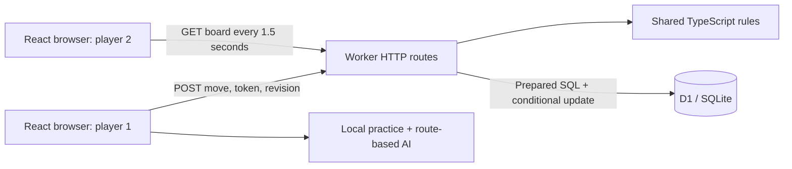

# Signal Duel: demo and interview guide

## A 60-second demo

1. Open Practice. Claim D4 and show the AI replying.
2. Explain the objective: each player connects a different pair of opposite edges.
3. Open Online in two independent browser windows. Create a room, join it, and alternate moves.
4. Refresh one player to demonstrate recovering the authoritative board and seat.
5. Click a move in the log and step backward. Return to the current match.
6. Open the tests and point out simultaneous seat and move requests.

Until deployed, demonstrate both browser windows on the same computer. Do not send a localhost link to a recruiter expecting it to work on their machine.

## Architecture

The rules engine is pure and has no browser or database dependencies. The UI and server both use `play`, but online play trusts only the server result. A request submits a cell and revision, never an entire replacement board. The server authenticates a seat, validates the turn and cell, calculates the new state, and conditionally updates the saved record.

## Why the interesting parts matter

**A hex board is a graph.** Each cell is a vertex with at most six neighbors. The two virtual target edges define the source and destination. BFS finds an actual winning chain in O(V + E), and its parent pointers provide the highlighted path.

**The AI measures connection cost.** A cell owned by the AI has cost zero; an empty cell has cost one; an enemy cell is blocked. Dijkstra finds the cheapest remaining route. Candidate moves are scored by improving the AI route and making the opponent route more expensive. Immediate wins and immediate threats take priority. The scan-based Dijkstra implementation is O(V²); evaluating O(V) candidate cells is O(V³), which is practical for just 49 cells. This is a deterministic heuristic opponent, not minimax, machine learning, or an unbeatable AI.

**Concurrency is a database problem.** A move writes with `WHERE code = ? AND revision = ?`. The winning request increments the revision. A second request using the same old revision affects zero rows and gets a conflict response. Joining similarly uses `guest_hash IS NULL`. A JavaScript read-check-write without the conditional SQL would fail when requests race across Worker instances.

**Authorization is distinct from a room code.** The room code lets someone occupy the available guest seat. It is not permission to submit a move as the host. Each seat gets two random UUIDs as a bearer token; the database stores only its SHA-256 hash. Read/move requests require the secret token in a header. Tokens are never in invite URLs. Losing the token loses the seat; there is no account recovery.

**Replay is deterministic.** A match stores an ordered move history alongside its current board. Starting from an empty board and applying a prefix of that history reconstructs a position. This is a replayable move log, not a complete event-sourcing platform.

## Tradeoffs to discuss candidly

- Polling makes deployment and recovery simple for a turn-based game, with roughly 40 reads per active client per minute. It adds up to around 1.5 seconds of opponent-update delay, plus network time. WebSockets with per-room Durable Objects would be a sensible extension at larger scale.
- Storing the small board and history together gives one atomic state update. Larger or long-running games could use normalized move records and snapshots.
- The board is 7×7 for short demonstrations. Hex favors the first player; this version deliberately omits the tournament swap rule. A fair competitive version should implement it and test swapped roles carefully.
- There is no leaderboard, fake user population, account system, public matchmaking, or invented performance benchmark.
- The AI evaluates positions greedily and can miss multi-turn tactics. Minimax or Monte Carlo tree search would be meaningful improvements. Measure performance before moving search to a Web Worker.
- The application is a portfolio prototype. Rate limiting, abuse controls, disconnect/resign/rematch flows, idempotent join retries, and deployment monitoring remain future work.
- Keyboard play and responsive layouts are included. The small mobile board is usable but benefits from larger touch targets or a zoom feature; there has been no formal accessibility audit.

## Suggested résumé wording after personalizing the project

**Signal Duel — Multiplayer Strategy Game | TypeScript, React, Cloudflare Workers, SQLite**

- Built a two-player browser strategy game with private rooms, server-validated turns, persistent match state, and deterministic move replay.
- Implemented BFS win detection and a Dijkstra-based AI opponent; prevented conflicting multiplayer updates with revision-based conditional SQL writes.
- Added automated rules and HTTP integration tests covering illegal moves, authorization, simultaneous seat claims, and concurrent turn submissions.

Adjust “built” and the other verbs to reflect your actual contribution. If asked, explain where AI assisted you and what you verified or changed. Do not claim production users, scale, response-time metrics, or completed hosting without evidence.

## A worthwhile next contribution

Pick one: implement and test the swap rule; replace polling with a per-room WebSocket server; build a stronger search opponent; or add reconnect-safe idempotency to room creation/joining. Explain the problem, alternatives, implementation, and test evidence in a small pull request. That story will add more interview value than adding decorative features.

## Verification performed in this session

- Eight rules tests passed, including 250 seeded complete-board winner checks.
- Twenty-nine local HTTP checks passed against D1, including two concurrency races and a completed match.
- TypeScript checking and a production Worker build passed.
- Practice move and AI reply were exercised in the browser. Two independent browser tabs created/joined a room and exchanged moves; the phone layout was checked for horizontal overflow. Replay, return-to-match, restoring a seat after refresh, and keyboard moves were also verified.
- No production deployment, multi-region latency test, or load test was completed.
